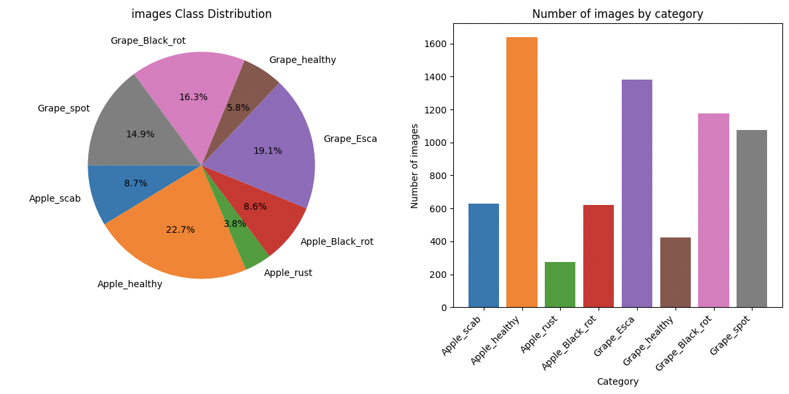
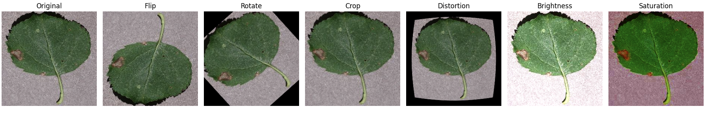
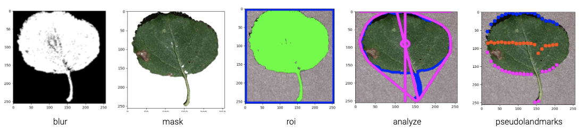

## Plant Leaf Disease Classification
This project aims to classify diseases in plant leaves using deep learning and computer vision techniques. It includes four main parts:
1. **Data Analysis**: Analyze and visualize the dataset to understand class distributions. The dataset consists of images of plant leaves with various diseases, organized into subdirectories by plant type and disease category.
<p align="center">

</p>

1. **Data Augmentation**: Balance dataset classes and improve model generalization using various augmentation techniques.
<p align="center">

</p>


3. **Image Transformation**: Apply image transformation methods for feature extraction and model learning.
<p align="center">

</p>

6. **Classification**: Develop and train convolutional neural network (CNN) models to accurately classify diseases in plant leaves.


## Usage
-----------------------
#### Data analysis
To analyze the dataset and generate pie charts and bar charts for each plant type.
```
python3 Distribution.py /path/to/dataset
```

#### Data Augmentation
To create augmented images using flip, rotate, crop, distortion , brightness and saturation techniques.
```
python3 Augmentation.py /path/to/image
```

#### Image Transformation
To apply image transformation methods such as crop, skew, and rotation for feature extraction:
```
python3 Transformation.py /path/to/image
```

#### Classification
To train CNN model classify diseases in plant leaves.
```
python3 train.py /path/to/dataset
```

To predict which disease the image represents :
```
python3 predict.py /path/to/image
```

## Requirements
- Python 3.x
- TensorFlow
- Keras
- NumPy
- OpenCV
- Matplotlib


## Contributors
<p>
<a href="http://github.com/jhparkkkk" alt="jhparkkkk github profile"></a>
<a href="https://github.com/guysharony" alt="guysharony github profile"></a>
</p>
